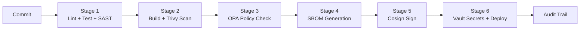

# End-to-End DevSecOps Pipeline with Compliance Gates

A complete CI/CD pipeline from commit to production with automated SAST (SonarQube), container scanning (Trivy), image signing (Cosign), OPA/Gatekeeper policy enforcement, SBOM generation, and HashiCorp Vault secrets injection. Produces SOC2-compliant audit trails for regulated environments.

## What This Is

Six automated security gates that every commit passes through before it can reach production:

```
Commit → Lint/Test/SAST → Trivy Scan → OPA Policy → SBOM → Cosign Sign → Vault + Deploy
```

Each gate blocks deployment if it fails. No exceptions without documented justification.

## Pipeline Architecture



## Quick Start

```bash
# Run the full pipeline locally
make pipeline

# Or run individual stages
make test        # Unit tests + coverage
make scan        # Trivy container scan
make policy      # OPA policy check
make sbom        # Generate SBOM
```

## Pipeline Stages

| Stage | Tool | What It Catches | Gate Criteria |
|---|---|---|---|
| 1. CI | golangci-lint, go test, SonarQube | Code bugs, low coverage, SAST vulnerabilities | Tests pass, 80% coverage, Quality Gate OK |
| 2. Container Scan | Trivy | CVEs in OS packages and dependencies | Zero CRITICAL/HIGH CVEs |
| 3. Policy Check | OPA/Conftest | Security misconfigurations | All 5 Rego policies pass |
| 4. SBOM | Syft | Supply chain blind spots | SBOM generated in SPDX format |
| 5. Image Sign | Cosign | Image tampering | Signature verifiable |
| 6. Deploy | Vault, kubectl | Credential exposure | Secrets from Vault, signature re-verified |

See [docs/pipeline-stages.md](docs/pipeline-stages.md) for detailed explanations.

## OPA Policies

Five Rego policies enforce organizational security standards:

| Policy | What It Enforces |
|---|---|
| `no-latest-tag` | Container images must use pinned version tags |
| `no-root-user` | Containers must run as non-root |
| `no-privileged` | No privileged mode in K8s manifests |
| `require-labels` | OCI labels for traceability |
| `resource-limits` | CPU/memory limits to prevent noisy neighbor |

## SOC2 Compliance

Each pipeline stage maps to specific SOC2 Trust Services Criteria. See [docs/compliance-mapping.md](docs/compliance-mapping.md) for the full mapping and auditor FAQ.

## Project Structure

```
├── .github/workflows/           # 5 GitHub Actions workflow files
│   ├── ci.yml                   # Lint + Test + SAST
│   ├── container-security.yml   # Trivy + Cosign
│   ├── policy-check.yml         # OPA/Conftest
│   ├── sbom-generate.yml        # Syft SBOM
│   └── deploy.yml               # Vault + Deploy + Audit
├── app/                         # Go service (pipeline target)
│   ├── main.go, main_test.go
│   └── Dockerfile               # Security-hardened (distroless, non-root)
├── policies/rego/               # 5 OPA/Rego security policies
├── vault/                       # Vault config + fine-grained policies
├── terraform/                   # IaC for pipeline infrastructure
│   └── modules/{vault,registry}
├── local-pipeline/              # Run all stages locally without GitHub Actions
├── examples/                    # Committed pipeline output artifacts
│   ├── trivy-scan-output.json
│   ├── sonarqube-report.json
│   ├── sbom-example.spdx.json
│   ├── audit-trail-example.md
│   └── policy-violation-output.txt
├── docs/                        # Design doc, compliance mapping, failure scenarios
├── docker-compose.yml           # Local SonarQube + Vault + OPA
└── Makefile                     # All commands
```

## Technologies

- **Application:** Go 1.22, distroless container
- **SAST:** SonarQube, gosec
- **Container Scanning:** Trivy
- **Image Signing:** Cosign/Sigstore (keyless)
- **Policy Engine:** OPA/Conftest with Rego policies
- **SBOM:** Syft (SPDX + CycloneDX)
- **Secrets:** HashiCorp Vault with AppRole auth
- **IaC:** Terraform with Docker provider
- **CI/CD:** GitHub Actions

## Documentation

- [Design Document](docs/design-doc.md) -- architecture decisions and trade-offs
- [Pipeline Stages](docs/pipeline-stages.md) -- each stage explained with diagrams
- [Compliance Mapping](docs/compliance-mapping.md) -- SOC2 control mapping
- [Failure Scenarios](docs/failure-scenarios.md) -- what happens when each gate fails
- [Demo Walkthrough](docs/demo-walkthrough.md) -- step-by-step demo script
