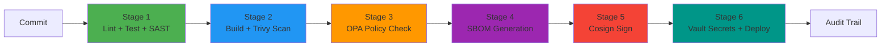

# Pipeline Stages

## Stage 1: CI (Lint, Test, SAST)

**Tools:** golangci-lint, go test, SonarQube, gosec

**What it catches:**
- Code style violations and potential bugs (lint)
- Logic errors and regressions (unit tests)
- SQL injection, XSS, hardcoded credentials (SAST)
- Go-specific security issues like unsafe pointer usage (gosec)

**Gate criteria:** All tests pass, coverage above 80%, SonarQube Quality Gate OK

**Why it matters:** Cheapest place to catch issues. A bug found here costs 10x less to fix than one found in production.

## Stage 2: Container Security (Trivy Scan + Build)

**Tools:** Docker, Trivy

**What it catches:**
- Known CVEs in OS packages (e.g., OpenSSL vulnerabilities)
- Known CVEs in application dependencies
- Dockerfile misconfigurations (running as root, exposed ports)

**Gate criteria:** Zero CRITICAL or HIGH severity vulnerabilities

**Why it matters:** Your code might be secure, but if you deploy it on top of a base image with known CVEs, you inherit those vulnerabilities. Trivy scans the entire image, not just your code.

## Stage 3: Policy Enforcement (OPA/Conftest)

**Tools:** Conftest, OPA, Rego policies

**What it checks:**
- No `:latest` tags (reproducibility)
- Non-root user (privilege escalation prevention)
- Required labels (traceability)
- Resource limits (availability protection)
- No privileged containers (container escape prevention)

**Gate criteria:** All policies pass

**Why it matters:** These are organizational security standards encoded as code. Instead of a security team reviewing every Dockerfile manually, the policies automate the review and enforce it consistently.

## Stage 4: SBOM Generation (Syft)

**Tools:** Syft

**What it produces:**
- Complete list of every package, library, and dependency in the image
- SPDX and CycloneDX formats for compatibility with different tools
- License information for compliance

**Gate criteria:** SBOM generated successfully (no blocking gate)

**Why it matters:** When a new CVE is announced (like Log4Shell), you need to answer "are we affected?" within minutes. Without an SBOM, you're manually checking every service. With an SBOM, you search for the package name across all your images.

## Stage 5: Image Signing (Cosign)

**Tools:** Cosign, Sigstore

**What it does:**
- Signs the container image with a cryptographic signature
- In CI: keyless signing using GitHub Actions OIDC identity
- Signature is stored in Rekor transparency log

**Gate criteria:** Signature created and verifiable

**Why it matters:** Without signing, anyone with registry access could push a malicious image tagged as your service. Signature verification at deploy time proves the image was built by your CI pipeline, not modified afterward.

## Stage 6: Deploy with Vault Secrets

**Tools:** HashiCorp Vault, kubectl

**What it does:**
- Verifies Cosign signature (reject tampered images)
- Authenticates to Vault via JWT
- Pulls secrets with a short-lived token (1h TTL)
- Injects secrets as environment variables
- Deploys to the target environment
- Generates an audit trail entry

**Gate criteria:** Signature verified, secrets retrieved, deployment successful

**Why it matters:** This is the final gate. Even if all previous stages pass, the deploy stage independently verifies the image hasn't been tampered with since it was signed. Secrets are never stored in CI — they come from Vault at the moment of deployment.
